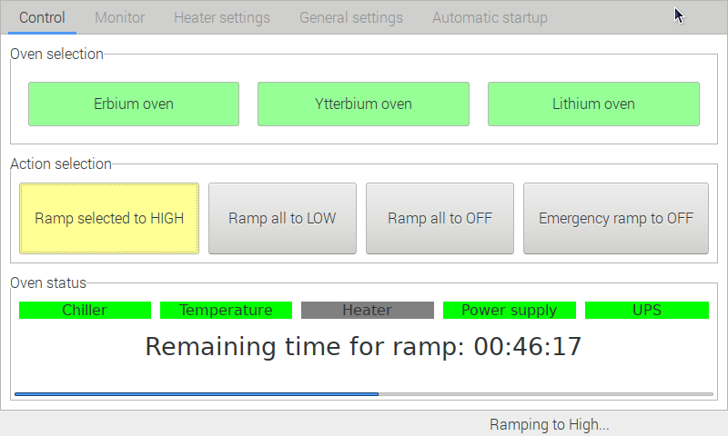
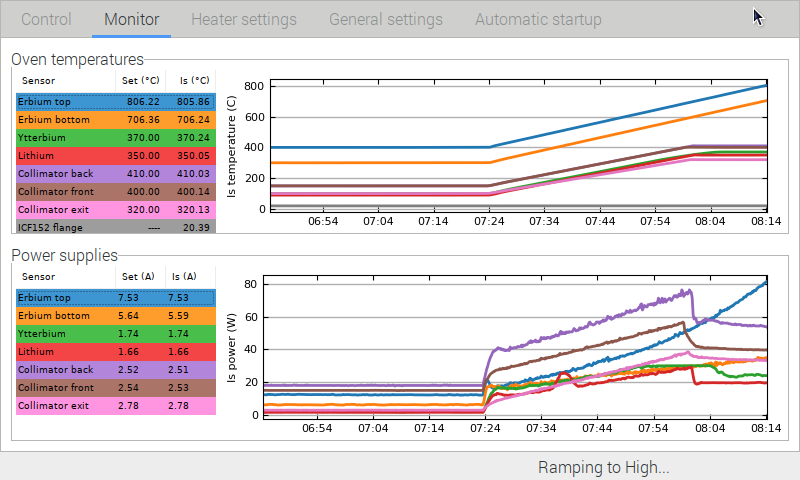
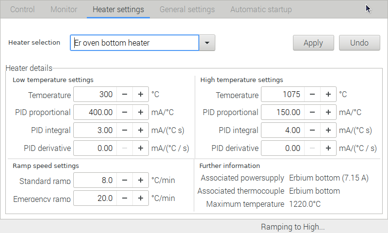
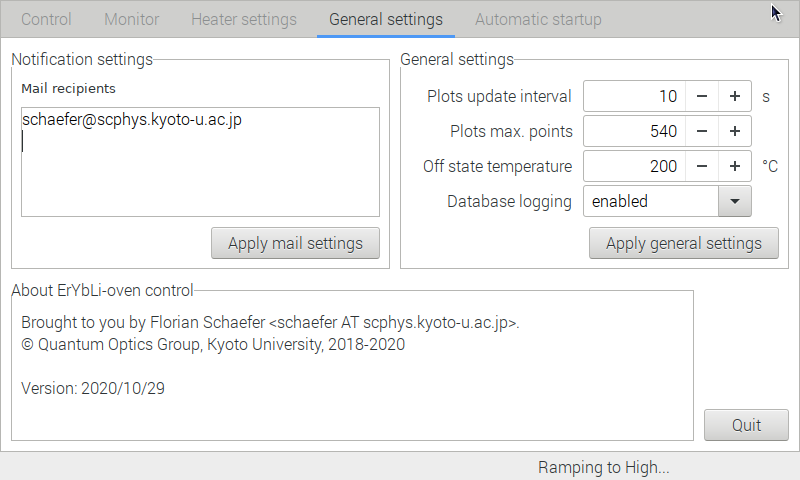
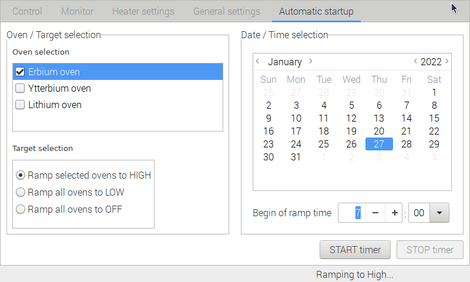
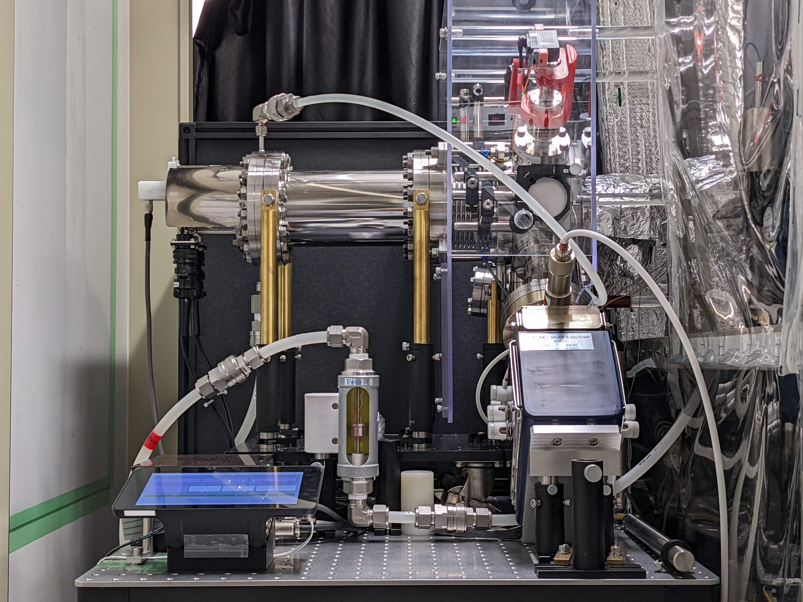
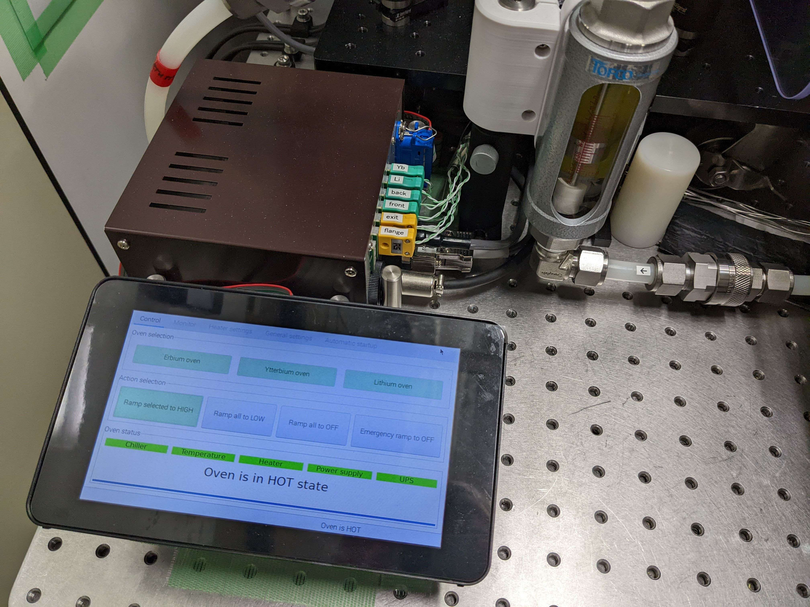
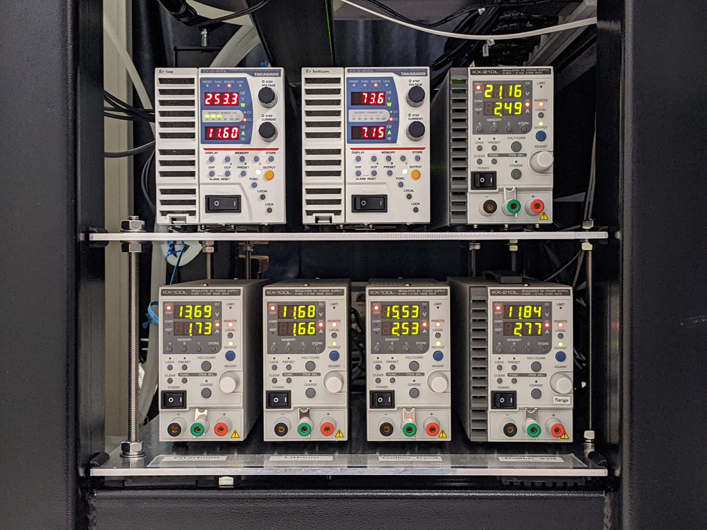

# ErYbLi-oven_control

This is the oven control program used in the ErYbLi experiment of the Quantum
Optics Group at Kyoto University.

It is intended to run on a Raspberry Pi with the corresponding Raspberry Pi
touchscreen installed. Additional technical details on the hardware
implementation can be found in the `README.txt` file.

ErYbLi-oven_control is built using Python (version 2.7) and wxWidgets (version
3.0).

## Feature overview

Normal interaction with the program is through a full-screen graphical user
interface. This interface is divided into five sections that are represented as
separate notebook tabs and that can be displayed as necessary. We will take a
look at the different tabs now.

### The main control page

In the **Oven selection** area the available ovens are listed as buttons.
Selected ovens are displayed in green and it is those ovens that will be
brought to their operating (that is high) temperatures. The operation mode of
the program is selected in the **Action selection** area. Here, the various
temperatures ramps for the selected ovens can be selected. Currently active
ramps are in yellow, once the target temperatures have been reached the button
turns green. Finally, the **Oven status** area displays the status of the
interlock system and, if applicable, the remaining time for the current ramp to
finish. The interlock system monitors the status of the cooling water flow, the
temperatures of all thermocouples, the resistances of all heating elements, the
status of all power supplies, and the information coming from one or more UPS
systems. Good interlocks are green, disabled interlocks are gray and failed
interlocks are red. A failed interlock triggers an emergency ramp of all ovens
to OFF.

### The monitor page

This page informs in the **Oven temperatures** area graphically and numerically
on the current actual oven temperatures and their set values. The **Power
supplies** area provides similar information on all power supplies. Clicking on
the temperature graph toggles between a plot of the temperatures and a plot of
the temperature errors. Correspondingly, clicking the power supply graph
switches between power and current information. Unneeded information can be
removed from the plots by clicking on the corresponding row of the left side
table.

### The heater settings page

This tab allows for each heater to quickly modify the low and high temperature
setpoints, the parameters of the PID control loop and the ramping speeds.
Additional information on the associated power supplies and the maximum
allowable temperature is also shown. As that information, however, is very
relevant to the secure operation of the oven system it cannot be modified
through the graphical user interface. Instead, the configuration file needs to
be adjusted manually.

### The general settings page

This page exposes some of the most fundamental settings of the program, such as
the mail recipients for status messages and some options on the monitor plots
and the database logging facility. For a complete control of the program
settings, however, it is necessary to manually edit the configuration file.

### The automatic startup page

To help with operating the oven at inconvenient times, the program includes the
possibility a execute the actions from the main control page also via a timer
mechanism. This allows, e.g. to start warming up the oven at a very early time
in the morning and to have everything up and running by the time the crew
arrives in the laboratory.

## Application example

As mentioned before, ErYbLi-oven_control has been developed for and is in use
at the ErYbLi experiment of the Quantum Optics Group at Kyoto University.
Below some pictures of the actual are show to give a better idea of what we
are talking of here in the first place.

First, a general overview of the setup. On an optical table the three-species
oven system is installed as part of the main vacuum system. It is visible
as the shiny stainless-steel tube in the background. A supporting ion pump is
visible on the right corner of the table. A flow sensor (central in the
picture) monitors the flow rate in the water cooling system. The control
software is installed on a Raspberry Pi, version 3, that is mounted in a case
together with the Raspberry touchscreen. The case is fixed to the table by a
custom, 3d-printed adapter pedestal.

The necessary electronics is mostly within a secondary box just behind the
Raspberry Pi. It contains the MAX31855 thermocouple readout boards, an
isolated RS232 serial port for communication with the power supplies, the
connection to the water flow sensor and a piezo buzzer. The electronics box
connects to the Raspberry Pi GPIO connector via a flatband cable.

Below the optical table is space to house the power supplies for the heating
elements. They are manufactured by Takasago, the smaller ones are from the
older KX series and provide between 100 and 210 W, the larger ones are more
recent ZX series supplies and provide up to 400 W. (Note that ZX power
supplies need to be put into EX compatibility mode. This is done by adjusting
function setting 61 to 1.) The first power supply is connected to the RS232
serial port of the electronics box and the other supplies are daisy-chained to
form a data bus where each power supply has its individual address.

## Contact

For any comments and/or bug reports please report to the author,
test@testdomain.jp.
